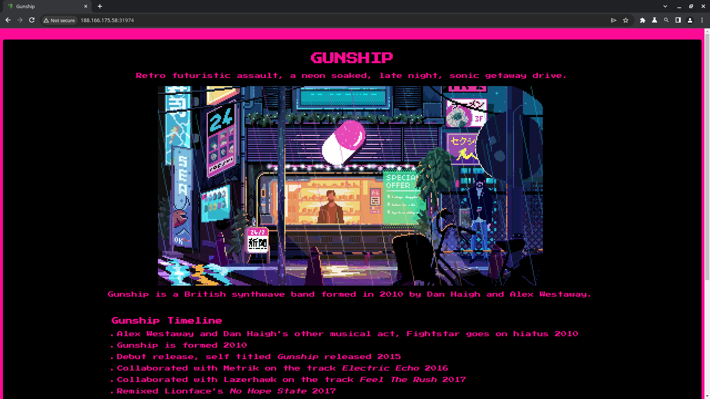
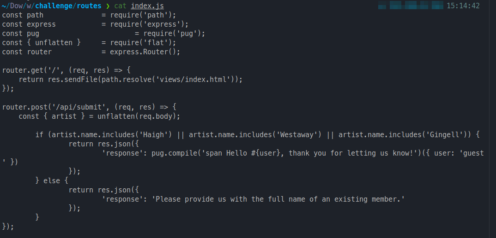

| Name | Gunship|
| :------ |:--- |
| Category | Web |
| RELEASE DATE | August 13, 2021 |
| DIFFICULTY |  Very Easy | 1

Start your instance or download the files if you want to look at the code which I recommend. 

> #### CHALLENGE DESCRIPTION
>
>A city of lights, with retrofuturistic 80s peoples, and coffee, and drinks from another world... all the wooing in the world to make you feel more lonely... this ride ends here, with a tribute page of the .> British synthwave band called Gunship. 🎶

Pretty small application, looking at the code it takes the input from an your favorite artist. if you input "Haigh", "Westaway", "Gingell". It gives you a different output, but nothing too interesting. This is the code that does all of that:

